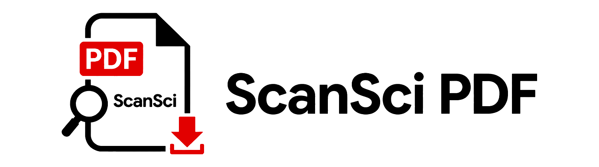

<p align="center">
  
</p>

<p align="center">
  <a href="https://pypi.org/project/scansci-pdf/"></a>
  <a href="https://pypi.org/project/scansci-pdf/"></a>
  <a href="LICENSE"></a>
  <a href="https://modelcontextprotocol.io"></a>
</p>

# ScanSci PDF

ScanSci PDF 是一个面向研究者和学生的论文 PDF 下载工具。给它 DOI、arXiv ID 或论文列表，它会自动尝试开放获取、出版商接口、机构访问和浏览器登录等路径，尽量把可合法访问的全文 PDF 保存到本地。

它适合这些场景：

- 下载单篇论文或批量 DOI 列表
- 搜索论文并获取 DOI、BibTeX、RIS、EndNote 引文
- 用学校账号、WebVPN、CARSI、EZProxy 或浏览器 SSO 访问订阅论文
- 为 Elsevier / ScienceDirect 配置 API Key，快速获取全文 PDF
- 在 Agent / MCP 客户端中把论文下载能力交给 AI 助手调用

使用任何来源下载论文时，请遵守你所在机构、出版商和当地法律法规的授权范围。

---

## 快速开始

### 1. 安装

```bash
pip install scansci-pdf
```

如果你需要学校登录、WebVPN/CARSI/EZProxy、Cloudflare 页面处理或可见浏览器下载，安装完整功能：

```bash
pip install "scansci-pdf[cloakbrowser,instsci]"
```

### 2. 检查环境

```bash
scansci-pdf check
```

### 3. 下载第一篇论文

```bash
scansci-pdf get 10.1038/nature12373
```

默认输出目录是：

```text
~/.scansci-pdf/papers
```

指定输出目录：

```bash
scansci-pdf get 10.1038/nature12373 --output downloads
```

### 4. 批量下载

准备一个文本文件 `dois.txt`，每行一个 DOI 或 DOI URL：

```text
10.1038/nature12373
10.1016/j.neunet.2026.108582
https://doi.org/10.1126/science.aec6396
```

然后运行：

```bash
scansci-pdf batch dois.txt --output downloads
```

---

## 推荐配置：Elsevier / ScienceDirect API

如果你经常下载 Elsevier、ScienceDirect 或 Cell Press 的论文，建议首先配置 Elsevier API Key。配置后，ScanSci PDF 会优先使用官方 API：

```text
Article Retrieval API ?view=FULL
  -> 获取全文 XML
  -> 解析 PDF attachment-eid
  -> Content Object API /content/object/eid/{eid}
  -> 下载出版社正式 PDF
```

这条路径绕过 ScienceDirect 网页、Cloudflare 和验证码，但闭源全文仍取决于你的机构订阅和请求 IP 是否有授权。

### 申请 API Key

1. 打开 <https://dev.elsevier.com/>
2. 注册或登录 Elsevier 账号。
3. 进入 `My API Key` / API Key Settings。
4. 创建 API Key；如果页面要求选择产品/API，选择 ScienceDirect / Article Retrieval 相关权限。
5. 复制 API Key，不要把它写进公开文档、日志或仓库。

### 保存到 ScanSci PDF

```bash
scansci-pdf elsevier-setup --api-key YOUR_KEY
```

如果你的图书馆明确提供 Elsevier institutional token，可以一并配置：

```bash
scansci-pdf elsevier-setup --api-key YOUR_KEY --inst-token YOUR_TOKEN
```

多数用户不需要 institutional token。校园网、学校 VPN、规则 VPN 或图书馆出口 IP 已经可能提供授权。若你配置了普通代理，请确认它没有覆盖 `api.elsevier.com` 的机构出口；ScanSci PDF 会对 Elsevier API 优先走 direct route，再回退到配置代理。配置后，可以下载一篇 Elsevier 论文确认是否已获得全文授权。

更详细的路径说明和排查方法见 [Elsevier API 全文 PDF 稳定路径](docs/elsevier-api-fulltext-guide.md)。

---

## 需要机构权限的论文

如果一篇论文不是开放获取，但你有学校或机构账号，可以使用以下方式。

### 统一浏览器登录

适合大多数出版商。工具会打开论文页面，你在浏览器里完成机构登录，之后 cookie 会保存复用。

```bash
scansci-pdf login --url https://www.sciencedirect.com/
scansci-pdf get 10.1016/j.neunet.2026.108582
```

### WebVPN

适合学校提供 WebVPN 的情况。

```bash
scansci-pdf schools 北京
scansci-pdf setup 北京大学
scansci-pdf fetch 10.1016/j.neunet.2026.108582 --format markdown
```

### CARSI / OpenAthens / Shibboleth

适合出版商页面提供 `Access through your institution`、`Institutional Login`、`OpenAthens` 或 `Shibboleth` 的情况。

```bash
scansci-pdf federated-login sciencedirect
scansci-pdf get 10.1016/j.neunet.2026.108582
```

登录、验证码、二次验证和机构密码都由用户在可见浏览器中完成，ScanSci PDF 不读取或保存你的密码。

---

## 常用命令

| 你想做什么 | 命令 |
|---|---|
| 检查环境 | `scansci-pdf check` |
| 下载单篇论文 | `scansci-pdf get DOI_OR_ARXIV` |
| 下载并输出更详细结果 | `scansci-pdf fetch DOI --format markdown` |
| 批量下载 DOI 列表 | `scansci-pdf batch dois.txt --output downloads` |
| 搜索支持的学校 | `scansci-pdf schools 清华` |
| 配置学校 WebVPN | `scansci-pdf setup 学校名称` |
| 浏览器登录出版商 | `scansci-pdf login --url 出版商网址` |
| 配置 Elsevier API | `scansci-pdf elsevier-setup --api-key YOUR_KEY` |
| 查看或修改配置 | `scansci-pdf config-cmd` |
| 启动 Web UI | `scansci-pdf web --port 8080` |
| 检查浏览器运行时 | `scansci-pdf browser-doctor` |

修改配置示例：

```bash
scansci-pdf config-cmd output_dir D:/papers
scansci-pdf config-cmd network_proxy socks5://127.0.0.1:1080
```

---

## 在 AI Agent / MCP 中使用

ScanSci PDF 也可以作为 MCP 服务运行，让支持 MCP 的 Agent 直接调用论文搜索、下载和引文工具。

### stdio 模式

在 Claude Desktop、Cursor、Windsurf、Cline 等 MCP 客户端中添加：

```json
{
  "mcpServers": {
    "scansci-pdf": {
      "command": "scansci-pdf",
      "args": ["run"]
    }
  }
}
```

### HTTP 模式

适合远程部署或 Web 调用：

```bash
scansci-pdf run --mode streamable_http --host 0.0.0.0 --port 8000
```

默认绑定 `0.0.0.0`，但只接受 hostname 为 `scansci-pdf` 的连接。如需接受其他域名（如 `example.com`），配置 `mcp_server_name`：

```bash
scansci-pdf config-cmd mcp_server_name example.com
# 或通过环境变量
MCP_SERVER_NAME=example.com scansci-pdf run --mode streamable_http
```

常用 MCP 工具：

| 工具 | 用途 |
|---|---|
| `scansci_pdf_download` | 下载单篇 DOI/arXiv |
| `scansci_pdf_batch_download` | 批量下载 |
| `scansci_pdf_search` | 搜索论文 |
| `scansci_pdf_citation` | 获取 BibTeX/RIS/EndNote |
| `scansci_pdf_login` | 打开浏览器完成机构登录 |
| `scansci_pdf_elsevier_setup` | 引导配置 Elsevier API Key |
| `scansci_pdf_network_diagnose` | 网络诊断 |

---

## 配置参考

| 配置项 | 默认值 | 说明 |
|---|---:|---|
| `output_dir` | `~/.scansci-pdf/papers` | PDF 保存目录 |
| `auto_rename` | `true` | 自动按作者/标题重命名 |
| `scihub_enabled` | `true` | 启用 Sci-Hub/LibGen 类来源 |
| `use_tor_for_scihub` | `true` | Sci-Hub/LibGen 走 Tor 代理 |
| `network_proxy` | 空 | HTTP/SOCKS 代理地址 |
| `batch_workers` | `10` | 批量下载并发数 |
| `instsci_enabled` | `false` | 启用 WebVPN |
| `instsci_school` | 空 | WebVPN 学校名称 |
| `carsi_enabled` | `false` | 启用 CARSI |
| `carsi_idp_name` | 空 | CARSI 机构名称 |
| `elsevier_api_key` | 空 | Elsevier / ScienceDirect API Key |
| `elsevier_insttoken` | 空 | Elsevier institutional token，可选 |
| `browser_headless` | `false` | 浏览器是否无头运行 |
| `browser_humanize` | `true` | 浏览器人性化操作 |
| `mcp_server_name` | `scansci-pdf` | MCP 服务接受的 hostname，支持 `MCP_SERVER_NAME` 环境变量 |

查看全部配置：

```bash
scansci-pdf config-cmd
```

---

## 可选高级功能

### Web UI

```bash
scansci-pdf web --port 8080
```

浏览器打开：

```text
http://localhost:8080
```

### Docker

适合长期运行服务或远程 MCP。

```bash
docker compose up -d
```

| 服务 | 端口 | 说明 |
|---|---:|---|
| `scansci-pdf` | `8000` | streamable HTTP MCP 服务 |
| `tor` | `1080` | Tor SOCKS5 代理 |

### Tor

如果你的网络无法访问某些来源，可以配置代理或使用 Tor。Docker 模式会提供 Tor 服务；本地模式可按诊断提示启用。

### CloakBrowser

遇到 Cloudflare、CAPTCHA、SSO 或出版商浏览器下载时，安装可选浏览器依赖：

```bash
pip install "scansci-pdf[cloakbrowser]"
scansci-pdf browser-doctor
```

---

## 故障排查

### 下载失败

先运行：

```bash
scansci-pdf check
```

如果你在 MCP 里使用：

```text
scansci_pdf_network_diagnose
```

### Elsevier 返回 `NOT_ENTITLED`

常见原因是当前请求没有走机构出口。请检查：

- 是否已经连接校园网、学校 VPN 或规则 VPN
- `api.elsevier.com` 是否被普通代理转发到非机构 IP
- 学校是否订阅了目标期刊和年份

### WebVPN 或机构登录失败

- 确认安装了完整依赖：`pip install "scansci-pdf[cloakbrowser,instsci]"`
- 在可见浏览器中完成登录、验证码或二次验证
- 登录后重新运行下载命令

### 下载速度慢

- 配置 Elsevier API Key 可显著改善 ScienceDirect 论文下载速度
- 批量任务可调整 `batch_workers`
- 网络受限时配置 `network_proxy`

---

## 更多资料

- [Elsevier API 全文 PDF 稳定路径](docs/elsevier-api-fulltext-guide.md)
- [Elsevier API 成功经验：迁移到 InstSci](docs/elsevier-api-success-experience-for-instsci.md)
- [10 篇 Elsevier 闭源文章实测记录](elsevier_10_closed_articles.md)

---

## 开发者说明

本项目可作为 Python 包、CLI、Web UI 或 MCP 服务使用。核心下载流程会按来源健康度、响应速度和历史成功率动态排序，并在开放获取、出版商接口、机构访问和浏览器流程之间回退。

从 GitHub 克隆的用户使用纯 Python 实现；从 PyPI 安装的用户可能获得预编译扩展以提升性能。

---

## 赞助者

<a href="https://github.com/qwlei328-maker"></a>
<a href="https://github.com/jingqingqiu1"></a>
<a href="https://github.com/minqifeng"></a>

---

## 致谢

本项目在开发过程中参考和借鉴了以下开源项目：

- **[FlareSolverr](https://github.com/FlareSolverr/FlareSolverr)** - 早期反 bot 绕过架构设计
- **[CloakBrowser](https://github.com/CloakHQ/CloakBrowser)** - Chromium stealth 浏览器
- **[ref-downloader](https://github.com/ltczding-gif/ref-downloader)** - Publisher 专用下载策略参考
- **[paper-fetch-skill](https://github.com/Dictation354/paper-fetch-skill)** - 论文获取 Agent Skill 设计
- **[paper-fetcher](https://github.com/fermionoid/paper-fetcher)** - 论文下载流程参考

感谢以上项目作者的开源贡献。

---

## 许可证

[Apache License 2.0](LICENSE)

例外：`src/scansci_pdf/_core/` 中的 Cython 编译扩展（`.pyd`/`.so`）为预编译二进制，仅通过 PyPI 分发。其 Cython 源码（`.pyx`）为专有代码，不包含在本仓库中。
